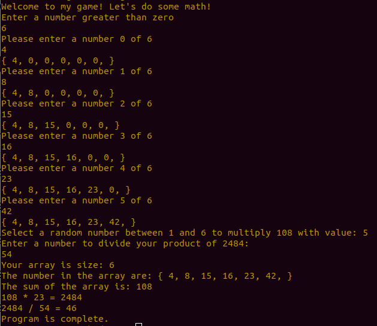

# Lab 01 Numbers-Game

## Author: Joseph Hangarter

### Description
A simple numbers game where a user inputs numbers into an array with specified input size. The array will be populated, and will first prompt the total of the array. The user will then be asked to input a random number depending on the array length. The product of the sum and the random number will be prompted. The user will then be asked to input a number to divide the produced product with. A summary will then prompt, and the program is completed.

### Getting Started
* Clone to local machine: `https://github.com/JCode1986/Numbers-Game.git`
* In CLI - type in `dotnet run` or `f5` hotkey in Visual Studio

### Methods
* `Main(int[])` - Entry point <-- `StartSequence`
    * `StartSequence()` - Starts all the other methods
        * `Populate(int[])` - User input for array size, and elements in array
        * `GetSum(int[])` - Returns total sum of populated array
        * `GetProduct(int[], int)` - returns product of sum and user input
        * `GetQuotient(int)` - returns quotien of product and user input

* Helper method
    * `GetNumbersInArray(int[])` - Prints out numbers in array 

### Visual

